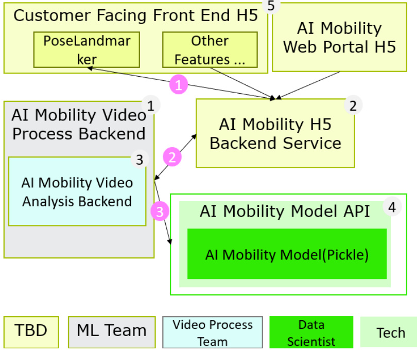

# HALEON  

# Request for Proposal  

AI 关节健康测评工具  

Version 1.0  

# AI 关节健康测评工具– Requirements  

Ver 1. 2024/09/25  

# 一、基本介绍  

# 1. 概述：  

1) 我们正在开发一款基于 AI 的关节健康测评工具，评估消费者行动力状况。该工具结合问卷和视频解析，通过分析用户完成特定动作提供个性化健康报告，帮助识别潜在的行动力问题。用户在媒介触点看到关节健康测评，点击后进入H5进行测试，根据测试结果个性化推荐风险解读和改善干预意见，平台基于用户历史记录显示对比情况。  
2) 此次需求重点是征集该评估工具的前端开发方案，规划为 H5 应用，涵盖用户交互，包括视频录制、问卷填写、主观反馈采集以及结果可视化等功能，确保用户可以流畅的完成整个测试流程。  

前端开发需要包括以下主要功能，根据前台功能的延展，需配套后台的功能模块。  

1) 测试启动：用户同意使用协议后进入测试流程。  
2) 短问卷收集用户基本信息。  
3) AI 关节健康测评：用户在查看拍摄说明和设备摆放要求后，播放动作演示视频并指导用户完成动作，测试流程包括 5 组视频，每个视频不超过 20s。拍摄过程中提供动作要点语音提示和实时动作辅助线，确保动作的规范性，完成动作后采集用户的主观感受。  
4) 如存在拍摄异常情况，前端进行提示。  
5) 报告生成与展示：测试完成后，平台生成分析报告，展示详细的健康状况和分项数据，并提供个性化的科普内容及相关产品推荐链接，支持生成海报并分享结果。  
6) 历史记录与动态分析：用户可以阶段性查看个人历史数据，通过动态曲线图追踪变化。  
7) 扩展功能支持：支持嵌入第三方平台，以扩展功能或与其他平台（天猫，京东等）合作。（该功能不包含在 12 月初的版本发布中，可以在后续版本中实现）  

# 3. 分工及其他说明  

1) AI 关节健康应用的视频分析和模型处理的后端部分将由其他团队处理，供应商需与其进行对接，具体对接细节请参考系统分工图，黄色部分由供应商负责。  

  

2) 前端需要考虑用户体验的流畅性，尤其是在视频拍摄及动作反馈时，保证系统响应及时。  
3) 前端设计需适配多种设备（移动端、平板、广告机等），保证跨平台兼容性。  
4) 以上需求，非特别注明，均期望支持私有化部署（微软 AZURE 云环境， PAAS）  
5) 测评过程中涉及到个人信息处理需遵守相关法规政策及 Haleon 内部合规、隐私和安全要求规范。  
6) 系统平台及消费者交互过程中收集、产生的数据都在中国境内部署和存储。  

# 二、供应商能力要求及选择标准：  

1. 供应商能力要求参考  

<html><body><table><tr><td>Category</td><td>Must Have</td><td>Nice To Have</td></tr><tr><td>系统开发能力</td><td>1.具备WebSocket的编程能力，支持双向通信和即时 数据更新。 2.具备DevOps能力。 3.供应商需具备强大的前端系统开发能力，尤其是在复杂 用户交互方面。 4.需要具备与后端系统对接的经验，确保数据的无缝传输和</td><td>1.具有开发超低实时交互前端界面的能力或 项目经验如，游戏/现场体验项目。 2.前端开发具备动画演示动效和实时捕捉/转 换人体动作辅助线的能力，确保系统能流畅展 示动态数据。</td></tr><tr><td>安全能力</td><td>解析。 1.产品开发具备必要的安全组件 2.公司具备相应安全证书（如等保证书）</td><td></td></tr><tr><td>数据分析和呈 现能力</td><td>供应商的方案应支持后台数据的展现及分析，提供日、周、 月的数据报告。</td><td>供应商具备Analytics、BI开发经验，能进 一步实现数据分析需求。</td></tr><tr><td>团队敏捷交付 能力</td><td>供应商团队需具备Agile敏捷交付的能力，下以Scrum为 例： 1.项目组需配备1位ScrumMaster确保项目以Scrum 的形式选代。 2.会使用至少一种敏捷管理工具（JiRA) 3.每日组织简短的Scrum站会，ProductOwner会参与 其中并了解项目情况。</td><td>1.一位ScrumMaster以及有敏捷交付经验 的 Scrum Team; 2.团队熟练使用Jira工具，有成员可以专门 负责ProductBacklog，SprintBacklog， story，Kanban等撰写和更新工作。 2.每个Sprint开始前需有明确的规划和目 标，结束后进行Sprint成果展示和内部回顾</td></tr></table></body></html>  

# 2. 合作伙伴选择参考标准:  

1) 相关项目管理经验、技术经验和技术实现能力  
2) 可持续优化能力  
3) Agile 项目管理能力  
4) 后续技术维护  

# 三、技术要求：  

1. 前端系统需要支持实时将人体动作转换为关键点辅助线形式，以便用户直观地看到自己的运动状态。  
2. 提供友好的用户界面（UI）和用户体验（UX）设计，确保系统使用流畅、设计美观。  
3. 系统需具备良好的性能优化，支持高效的视频录制与上传，并确保实时反馈和数据展示不会出现延迟。  
4. 支持现代浏览器和跨平台应用，确保在不同设备上都有一致的用户体验。  
5. 供应商需提供项目的技术栈说明及开发过程中所使用的工具和框架。  

# 四、安全合规要求：  

1. 产品开发具备网络安全等级保护制度（MLPS）、个人信息保护法（PIPL）、数据安全法（DSL）和葛兰素史克自身安全需要的安全组件 (如 HTTPS 数据传输，数据备份和加密等) ；  
2. 产品部署具备网络安全等级保护制度（MLPS）、个人信息保护法（PIPL）、数据安全法（DSL）和葛兰素史克自身安全需要的 Azure Cloud 安全组件（如 VNet，Firewall，WAF 和 jumpserver 等）；  
3. 系统等级需达到网络安全等级保护制度（MLPS）、个人信息保护法（PIPL）、数据安全法（DSL）标准和葛兰素史克系统标准，如有冲突取高标准。  

# 五、本次 Request for Proposal 提案需包括：  

2. 方案规划、包括建议的工期、实现所有需求的路线图a. 原型实现：满足进博会展示 demo （11 月 5 日开幕）b. 迭代 1：基础版本能够配合新产品上线市场宣传，12 月初。c. 迭代 2：对迭代#1 的优化和补足，1 月初。  

3. 技术架构规划  

7. 项目投入资源规划和建议（包括人力成员安排）；另外为实现项目，请说明 Haleon 端需要的配套需求。  
8. Azure 云 Running Cost 费用预估（以一年为例）。  